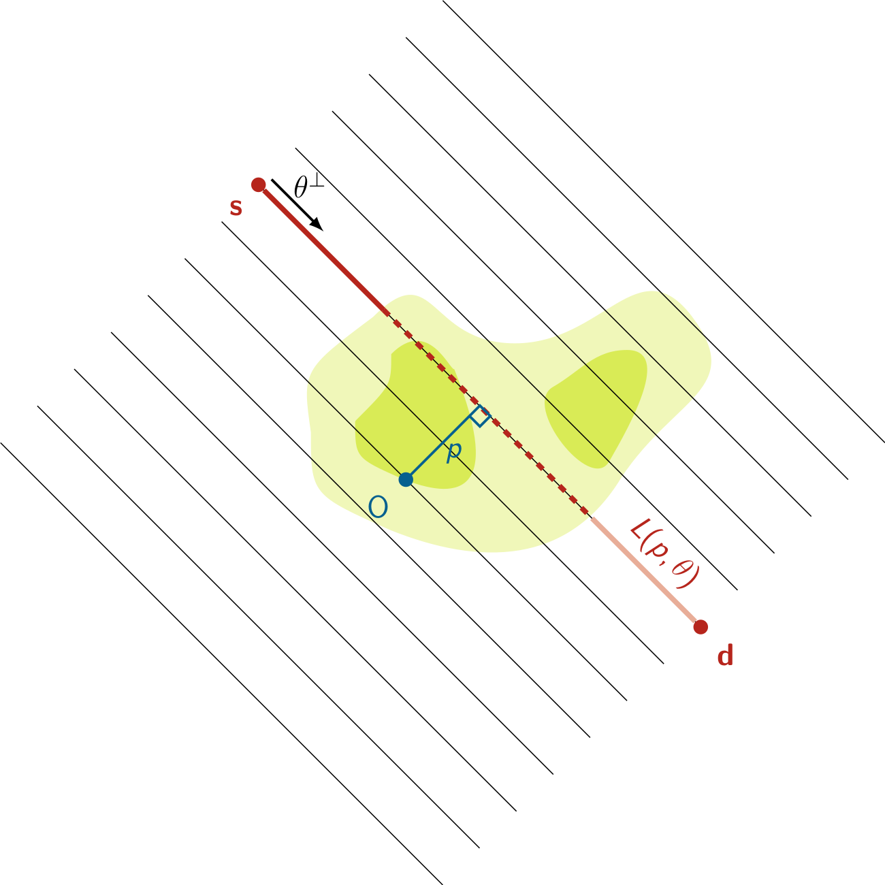

# XRay-Transform
This repository provides a basis for anyone wishing to work on algorithms in medical imaging, and more specifically, in computed tomography. It focuses on X-ray and Radon transforms. Standard reconstruction techniques are available. 

## Computerized Tomography

Computerized tomography (CT) became one of the most popular and standard imaging techniques for medical and industrial applications. Its principle  lies on the property of propagation of X-rays, discovered by Wilhelm Röntgen in 1895 at the university of Würzburg, and was developed by Godfrey Hounsfield who won the Nobel Price in 1979 with Allan M. Cormack who studied the inverse problem associated to the so-called Radon transform.

A photon beam, represented by its intensity $I$, flying in a closed domain $\Omega$ with energy $E$ and direction $\vartheta$ satisfies the \textbf{stationary transport equation}
$$\vartheta \cdot \nabla_\mathbf{x} I(\mathbf{x},\vartheta) + a_E(\mathbf{x}) I(\mathbf{x},\vartheta) = 0, \qquad \mathbf{x} \in \Omega \%$$
with $a_E(\mathbf{x})$ called the lineic attenuation coefficient at energy $E$. This coefficient depends on the type of material and represents the \textit{resistance} of the atomic structure to the propagation of the photons. Consider two points S (source) and D (detector) with respective position $s$ and $d$ and note $s-d = r\vartheta$. Solving this ordinary differential equation between S and D leads to the so-called \textbf{Beer-Lambert law} which describes the attenuation of the photon beam between S and D
$$I(\mathbf{s}+r\vartheta,\vartheta)= I(\mathbf{s},\vartheta) \exp\left(-\int_{0}^{r} a_E\left(\mathbf{s}+ t \vartheta \right) \mathrm{d}t\right). \%$$
\vspace{1em}
This relation implies that knowing the intensity at S and measuring the intensity at D gives an information about the integral of the attenuation coefficient under the form 
$$\ln \frac{I(\mathbf{s},\vartheta)}{I(\mathbf{s}+r\vartheta,\vartheta)} = \int_{0}^{r} a_E\left(\mathbf{s}+ t \vartheta \right) \mathrm{d}t. \%$$
Assuming that the object is compactly supported into $\Omega$ and neglecting the attenuation of the air around the object, one gets 
$$\ln \frac{I(\mathbf{s},\vartheta)}{I(\mathbf{s}+r\vartheta,\vartheta)} = \int_{\mathbb{R}} a_E\left(\mathbf{s}+ t \vartheta \right) \mathrm{d}t \%$$
which is simply the integral of the attenuation coefficient along the straight line passing through $s$ with direction $\vartheta$. In two dimensions, this coincides with the X-ray transform or after a suited change of variable with the well-known Radon transform.

## Parallel Geometry

### Radon transform (1917)

Let $f\in S(\Omega)$, $\Omega \subset \mathbb{R}^2$. Then, the Radon transform maps $f$ into its line integrals
$$\mathcal{R} f(p,\theta) := \int_{\mathbf{x}^\top \theta = p} f(\mathbf{x}) d\mathbf{x} = \int_{\Omega} \delta(\mathbf{x}^\top \theta - p) f(\mathbf{x}) d\mathbf{x} = \int_\mathbb{R} f(p\theta + t\theta^\perp)dt, \quad (p,\theta) \in \mathbb{R} \times S^1. \%$$
Here $p=\mathbf{x}^\top \theta$ stands for the normal form of the straight line with normal vector $\theta = (\cos\varphi,\sin\varphi)^\top$, $\varphi \in [0,2\pi]$ and distance to the origin $p$. The straight line denoted by $L(p,\theta)$ is defined by
$$L(p,\theta) := \lbrace \mathbf{x} \in \mathbb{R}^2 \ : \ p = \mathbf{x}^\top \theta = x \cos \varphi + y \sin \varphi  \rbrace.\%$$
In the 2D case, $\theta^\perp = \vartheta = (\mathbf{d}-\mathbf{s})/\Vert \mathbf{d}-\mathbf{s}\Vert$.

### Discretization

Both lines and the sinogram are discretized by two vectors $(p_k)_k$ and $(\varphi_l)_l$. For instance,  $(p_k)_k \in [-P,P]^\kappa \subset \mathbb{R}^{\kappa}$, $P>0$, and 
$(\varphi_l)_l = (0,\ldots,\pi(\lambda-1)/\lambda)~\in~\mathbb{R}^\lambda$.
